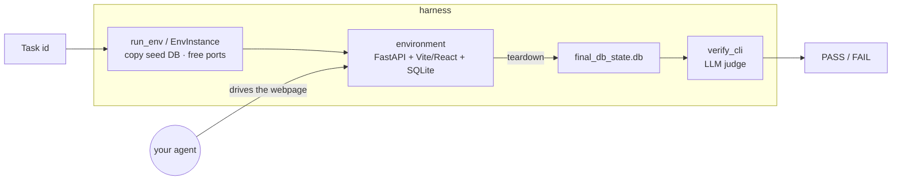
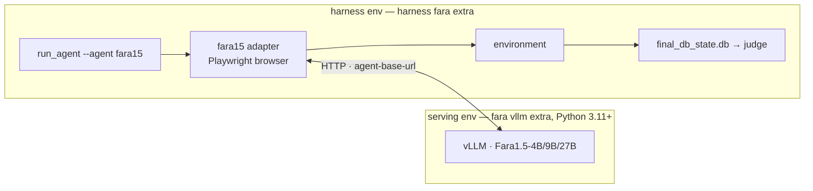

# Synthetic Env Harness

A small, self-contained toolkit to **run** the Echoverse synthetic environments and
**verify** agent tasks.  You bring your own agent; the harness only:

1. **launches an environment** for a task, with per-task database isolation and
   OS-assigned free ports (so you can run many instances at once), and
2. **grades the result** — LLM-based evaluation over any OpenAI-compatible API
   (OpenAI, Azure OpenAI with an API key, or Azure OpenAI with Azure AD
   credentials).

Don't have an agent? An optional **Fara1.5 reference agent** ships with the
harness, so you can go from a task id to a graded result out of the box — see
[Run with Fara1.5](#run-with-fara15-reference-agent).



## Install

```bash
pip install -e harness            # deps: openai, requests, python-dotenv, azure-identity
# note: Azure AD (Entra ID) auth to Azure OpenAI works out of the box —
# azure-identity is a core dependency. The `azure` extra remains as a no-op alias.
```

Runtime prerequisites (same as running an env directly):

- **Python 3.10+**, **[uv](https://docs.astral.sh/uv/)**, **Node.js 18+** (for the env frontends)
- **`sqldiff`** (from the [SQLite tools bundle](https://www.sqlite.org/download.html)) —
  required for **LLM write-task verification**. `apt install sqlite3-tools`
  or `brew install sqlite`.
- **LLM credentials** — required for verification. The judge uses any
  OpenAI-compatible endpoint; config is read from the environment or a repo-root
  `.env` file (see [Verify a task](#verify-a-task)). We recommend `gpt-4o`.

## Environments

| Env | Port | Tasks | Grounding DB |
|---|---|---|---|
| `echostay` | 8000 | `tasks/test_tasks.jsonl` | [`echostay.db`](https://huggingface.co/datasets/microsoft/Echoverse/blob/main/echostay/echostay.db) · 21 MB |
| `echoforge` | 8051 | `tasks/test_tasks.jsonl` | [`echoforge.db`](https://huggingface.co/datasets/microsoft/Echoverse/blob/main/echoforge/echoforge.db) · 344 MB |
| `datepickers` | 5400 | `tasks/test_tasks.jsonl` | [`datepicker_grounded.db`](https://huggingface.co/datasets/microsoft/Echoverse/blob/main/datepickers/datepicker_grounded.db) · 3.6 MB |
| `datepickers_ood` | 5401 | `tasks/test_tasks.jsonl` | [`datepicker_ood_grounded.db`](https://huggingface.co/datasets/microsoft/Echoverse/blob/main/datepickers_ood/datepicker_ood_grounded.db) · 1.0 MB |
| `nested_filter` | 5500 | `tasks/test_tasks.jsonl` | [`nested_filter.db`](https://huggingface.co/datasets/microsoft/Echoverse/blob/main/nested_filter/nested_filter.db) · 172 KB |
| `nested_filter_ood` | 5501 | `tasks/test_tasks.jsonl` | [`nested_filter_ood.db`](https://huggingface.co/datasets/microsoft/Echoverse/blob/main/nested_filter_ood/nested_filter_ood.db) · 104 KB |

The test tasks ship in the repo; the grounding **databases are not committed** — pull them from the
Hugging Face dataset **[microsoft/Echoverse](https://huggingface.co/datasets/microsoft/Echoverse)**,
**from the repository root**:

```bash
pip install -U huggingface_hub          # provides the `hf` CLI
hf download microsoft/Echoverse --repo-type dataset --include "*/*.db" --local-dir ./envs
```

This places each DB at `envs/<env>/<grounding>.db`, where the launcher expects it. For a single
env, name its file — e.g.
`hf download microsoft/Echoverse echostay/echostay.db --repo-type dataset --local-dir ./envs`.

## Run one task

```bash
python -m harness.run_env --env echostay --task ATE0001 \
    --output-dir ./runs/ATE0001
```

This copies the seed DB, launches the backend + frontend on free ports, and
prints the URL your agent should drive. Press Ctrl-C to tear down; the post-run
database is captured to `./runs/ATE0001/final_db_state.db`.

### Programmatic use (context manager)

```python
from harness.launcher import EnvInstance

with EnvInstance("echostay", task_id="ATE0001",
                 output_dir="./runs/ATE0001") as inst:
    drive_my_agent(inst.url)          # your agent
# inst.final_db_path -> ./runs/ATE0001/final_db_state.db
```

## Run many instances at once

Each `EnvInstance` allocates its own free ports and its own DB copy, so instances
are fully isolated — just start several:

```python
from harness.launcher import EnvInstance

insts = [EnvInstance("echoforge", task_id=t).start() for t in task_ids]
try:
    run_agents_in_parallel([i.url for i in insts])
finally:
    for i in insts:
        i.close()
```

No external services or Docker are required — each instance uses OS-assigned free
ports.

## Verify a task

Grading is **LLM-based**: a judge scores semantic equivalence via an
OpenAI-compatible model (recommended: `gpt-4o`). The judge prompts are the same
ones used to produce the benchmark's reference scores.

```bash
python -m harness.verify_cli --env echostay --task ABH0002 \
    --answer "Brighton"

python -m harness.verify_cli --env nested_filter --task W01_E03_G011 \
    --final-db ./runs/W01_E03_G011/final_db_state.db
```

It returns `PASS`/`FAIL` with a score of `1.0` or `0.0`.

### Configuring credentials (`.env`)

Config is read from the environment, or from a `.env` file at the repo root
(loaded automatically). The generic `LLM_*` keys are supported alongside the
conventional OpenAI / Azure names. Copy `.env.example` to `.env` and fill in one
of the following:

| Purpose | Generic key | OpenAI / Azure equivalents |
|---|---|---|
| Endpoint | `LLM_ENDPOINT` | `AZURE_OPENAI_ENDPOINT`, `OPENAI_BASE_URL` |
| API key | `LLM_API_KEY` | `AZURE_OPENAI_API_KEY`, `OPENAI_API_KEY` |
| Deployment | `LLM_DEPLOYMENT_NAME` | `AZURE_OPENAI_DEPLOYMENT` |
| Model | `LLM_MODEL_NAME` | `OPENAI_MODEL` |
| API version | `LLM_API_VERSION` | `OPENAI_API_VERSION` |

**Auth modes** (auto-detected, or force with `--auth {auto,openai,azure-key,azure-ad}`):

- **`openai`** — a non-Azure endpoint (or none) + an API key → plain OpenAI /
  OpenAI-compatible.
- **`azure-key`** — an `*.azure.com` endpoint **with** an API key → Azure OpenAI.
- **`azure-ad`** — an `*.azure.com` endpoint **without** an API key → Azure OpenAI
  authenticated via `DefaultAzureCredential` (`az login` / managed identity).
  `azure-identity` ships as a core dependency, so this works out of the box.

## Run with Fara1.5 (reference agent)

The harness is agent-agnostic, but it ships an **optional reference agent** that
drives the environments with Microsoft's released **[Fara1.5](https://github.com/microsoft/fara)**
computer-use models — so you can go from a task id to a graded result without
writing any agent code. It is a thin adapter: it launches the env with
`EnvInstance`, drives the live browser with the
public `fara` package, captures
`final_db_state.db`, and can grade the result with the same LLM judge as
`synthenv-verify`.

The model and the harness run in **two separate processes** that talk only over an
OpenAI-compatible HTTP endpoint — so you serve the model once and reuse it:



### 1. Install

```bash
pip install -e "harness[fara]"      # adds the public microsoft/fara (+ Playwright)
python -m playwright install chromium
```

`fara` is an **optional extra** — the core harness never imports it, so `pip
install -e harness` alone stays lightweight. `fara` is a research preview and is
not on PyPI, so the extra installs it **git-pinned** from
`github.com/microsoft/fara`.

> **Python 3.11+ required for this extra.** The core harness runs on Python
> 3.10+, but the public `fara` package uses `enum.StrEnum` (added in 3.11), so
> the Fara1.5 reference agent needs **Python ≥ 3.11**. Use a 3.11/3.12
> environment for `harness[fara]`.

The Fara **model** runs in its *own* process/endpoint (below), not inside the
harness — so the vLLM serving stack is intentionally **not** part of this extra.

### 2. Download the model weights

The three Fara1.5 models are **public and ungated on Hugging Face — no token or
gated-access request is required**:

| Model | Hugging Face repo | Approx. size (bf16) | Fits |
|---|---|---|---|
| Fara1.5-4B | `microsoft/Fara1.5-4B` | ~8 GB | 1 GPU |
| Fara1.5-9B | `microsoft/Fara1.5-9B` | ~18 GB | 1 GPU |
| Fara1.5-27B | `microsoft/Fara1.5-27B` | ~54 GB | 1 GPU (80 GB) or 2× via tensor-parallel |

There are **two ways** to get the weights:

**(a) Automatic (simplest).** Just serve the HF repo id — vLLM downloads the
weights on first launch into the Hugging Face cache and reuses them afterwards:

```bash
bash scripts/serve_fara15.sh 9b            # pulls microsoft/Fara1.5-9B on first run
```

The cache defaults to `~/.cache/huggingface` (override the location by exporting
`HF_HOME=/path/to/cache` before serving). Make sure you have room for the model
size above; the first launch also prints download progress.

**(b) Pre-download (recommended for repeat/offline runs).** Fetch the weights
once to a local directory, then serve that directory:

```bash
# needs: pip install -U "huggingface_hub[cli]"
hf download microsoft/Fara1.5-9B --local-dir ./models/Fara1.5-9B
# (older CLIs: huggingface-cli download microsoft/Fara1.5-9B --local-dir ./models/Fara1.5-9B)

bash scripts/serve_fara15.sh 9b 5002 0 1 ./models/Fara1.5-9B   # serve the local path
```

Serving a local path avoids re-downloading and works air-gapped. The served
model name stays `Fara1.5-9B` regardless of where the weights come from.

### 3. Serve the model (vLLM)

`scripts/serve_fara15.sh` wraps `vllm serve`. **vLLM must be installed in the
environment you run the script from** — and it is intentionally kept **separate**
from the harness (the `[fara]` extra does *not* include vLLM, to keep the harness
lightweight). If you see `serve_fara15.sh: exec: vllm: not found`, you're in the
wrong environment — create/activate a dedicated serving venv first:

```bash
# create a dedicated serving env ONCE (Python >= 3.11):
python3.12 -m venv ~/.venvs/fara-serve          # or: uv venv --python 3.12 ~/.venvs/fara-serve
source ~/.venvs/fara-serve/bin/activate
pip install "fara[vllm] @ git+https://github.com/microsoft/fara.git"   # vllm==0.19.1, ...

# thereafter, just activate it before serving:
source ~/.venvs/fara-serve/bin/activate
vllm --version                                  # sanity check: should print 0.19.1
```

With that env **activated**, run the serve script:

```bash
# usage: scripts/serve_fara15.sh <4b|9b|27b> [port] [gpus] [tp] [model_path]
CUDA_VISIBLE_DEVICES=0 bash scripts/serve_fara15.sh 9b               # 9B on GPU 0, port 5002
bash scripts/serve_fara15.sh 27b 5002 0,1 2                          # 27B, tensor-parallel 2
VLLM_ENFORCE_EAGER=1 bash scripts/serve_fara15.sh 9b                 # fast (~1 min) startup
```

> The serving env (`fara[vllm]`) and the harness env (`harness[fara]`) are two
> **separate** environments (see the diagram above). Serve the model from the
> former; run `python -m harness.run_agent --agent fara15` from the latter.

- **4B / 9B** fit on a single GPU. **27B** fits on one 80 GB GPU, or use
  `-tp 2` across **a matched NVLink pair** (e.g. GPUs `0,1` or `2,3`) — never
  split a tensor-parallel group across a non-NVLink (`SYS`/PCIe) hop; check your
  layout with `nvidia-smi topo -m`.
- The script sets `--max-model-len 20000` and the agent uses **temperature 0**
  and the Qwen3.5 **non-thinking prefix** (`enable_thinking:false`); keep these
  or the model may reason in prose instead of emitting actions.
- First real start compiles the vision-tower kernels (~5–6 min); pass
  `VLLM_ENFORCE_EAGER=1` to skip `torch.compile`/CUDA-graph capture for a much
  faster startup (small runtime cost — good for smoke tests).

### 4. Run a task

```bash
python -m harness.run_agent --agent fara15 --env datepickers --task dpg_0008 \
    --output-dir ./runs/dpg_0008
```

| Flag | Default | Meaning |
|---|---|---|
| `--env` | (required) | One of the registered envs |
| `--task` | (required) | Task id to run |
| `--output-dir` | `./runs/<task>` | Where artifacts are written |
| `--agent-base-url` | `http://localhost:5002/v1/` (env `FARA_BASE_URL`) | The vLLM endpoint |
| `--agent-model` | `Fara1.5-9B` (env `FARA_MODEL`) | Served model name — **switch size here** |
| `--agent-api-key` | `not-needed` (env `FARA_API_KEY`) | Endpoint API key |
| `--max-rounds` | `100` | Max agent steps |
| `--headful` | off | Show the browser window |
| `--verify` | off | Grade with the LLM judge after the run |
| `--judge-model` / `--judge-base-url` / `--auth` | env / `auto` | Judge endpoint (see [Verify](#verify-a-task)) |

The run writes into `--output-dir`: per-step `screenshot_<n>_pre/post.png`, a
`data_point.json` trajectory (task, actions, observations), and the
`final_db_state.db` captured on teardown. To target a different model size, serve
it and pass `--agent-model Fara1.5-27B` (with a matching `--agent-base-url`).

### 5. Verify

Add `--verify` to grade inline after the run, or grade later against the captured
DB with `verify_cli`:

```bash
python -m harness.verify_cli --env datepickers --task dpg_0008 \
    --final-db ./runs/dpg_0008/final_db_state.db
```

The judge reads its endpoint/credentials from the environment or a repo-root
`.env` (see [Configuring credentials](#configuring-credentials-env)); `gpt-4o`
is recommended.

### End-to-end example

```bash
# shell 1 — serve the model
CUDA_VISIBLE_DEVICES=0 VLLM_ENFORCE_EAGER=1 bash scripts/serve_fara15.sh 9b

# shell 2 — run + grade one datepicker task
python -m harness.run_agent --agent fara15 --env datepickers --task dpg_0008 \
    --output-dir ./runs/dpg_0008 --verify
# -> Final answer / Final DB captured / PASS score=1.0
```

### Troubleshooting

- **`fara` not installed** — `pip install -e "harness[fara]"` then
  `python -m playwright install chromium`.
- **`Executable doesn't exist ... chromium`** — run `python -m playwright install chromium`.
- **Model returns prose, no actions** — ensure the server preserves
  `enable_thinking:false` and temperature 0 (the runner sends both).
- **Slow first startup** — first vLLM launch compiles kernels; use
  `VLLM_ENFORCE_EAGER=1` for smoke tests.
- **Judge errors** — verification needs OpenAI-compatible credentials
  (`.env` / `az login`); the *run* itself does not.

## Run an agent over many tasks (batch)

To run a solver agent over a random sample of one env's tasks (writing each
trajectory in the `eval/v02` on-disk layout), use the batch driver:

```bash
python -m harness.eval.batch --agent fara15 --env datepickers --num-tasks 5 --seed 0 \
    --output-root ./runs
```

## Bring your own agent

The harness is **agent-agnostic**: `run_agent` and `eval/batch.py` select a solver
via `--agent <name>`. An agent is any class implementing the tiny
`harness.agents.base.Agent` protocol:

```python
# harness/agents/myagent.py
from . import register
from .base import Agent, AgentResult

@register("myagent")
class MyAgent(Agent):
    name = "myagent"
    def __init__(self, *, base_url=None, model=None, api_key=None):
        ...  # capture endpoint/model config here
    async def drive(self, *, url, task_id, instruction, output_dir,
                    max_rounds, headless) -> AgentResult:
        ...  # act on `url`, write trajectory artifacts to `output_dir`
        return AgentResult(final_answer="...", n_actions=12, aborted=False)
```

Then run it: `python -m harness.run_agent --agent myagent --env datepickers --task dpg_0008`.
`harness/agents/fara15.py` is the reference implementation. Optional dependencies
(like `fara`) should be imported **inside** `drive` so the core stays light.

## How task types are graded

Every env is graded uniformly by the LLM judge:

| Task type | How it is graded |
|---|---|
| `read` | judge compares the agent's answer to `reference_answer` |
| `write` | `sqldiff(seed, final)` is judged against `reference_state_change` |
| `read_write` | `min(read, write)` |

datepicker and nested_filter tasks are all `write`-style: the agent's action
records a row (`datesubmission` / `submissions`) that `sqldiff` surfaces, which
the write judge grades against `reference_state_change`.

## Package layout

```
harness/
  launcher.py    # EnvInstance: DB copy, ports, start/stop, final-DB capture
  ports.py       # free-port allocator
  registry.py    # the six envs: dir / db / task files / per-task args
  verify.py      # LLM judges: read + write + read_write
  llm.py         # OpenAI / Azure OpenAI client (API key or Azure AD)
  prompts.py     # judge prompts
  sqltools.py    # run_sqldiff
  tasks.py       # load test tasks / find a task by id
  util.py        # jsonl loading / tolerant json parsing
  run_env.py     # CLI: launch one instance for a task
  verify_cli.py  # CLI: grade a task with the LLM judge
  run_agent.py   # CLI: run a solver agent against one task (--agent; default fara15)
  agents/        # ── pluggable solver-agent seam ──
    base.py      #   Agent protocol + AgentResult
    __init__.py  #   registry: register / get_agent / available
    fara15.py    #   ★ reference agent (optional [fara] extra) — the worked example
  eval/          # ── agent-agnostic evaluation helpers ──
    trajectory.py  # eval/v02 on-disk layout writers
    batch.py       # CLI: batch/random-sample an agent over an env, eval/v02 output
```
